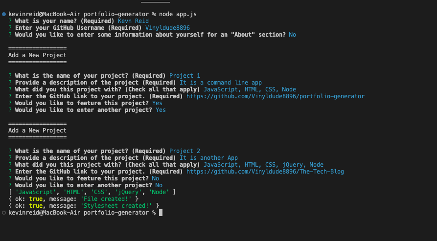
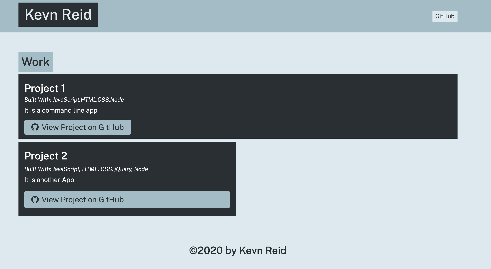

# Portfolio-Generator

### User Story

As a user I would like a command line application that will then generate a portfolio HTML page for me. When I run the app I should be prompted with several questions relatinhg to information I would liek to see in my Portfolio. This information should be personal information as well as information about my projects. I should be prompted to enter as many projects as I want to add to the Portfolio.

### Features
This web application is a command line application that generates an HTML Portfolio for the user.
This application will ask the suer for thier personal information to add to the header and About me section.
This application will prompt the user to keep adding projects until they are finished.
When the user is finished adding projects and index.html page is generated and added to the 'dist' folder

### Badges

## Table of Contents

- [installation](#installation)
- [contribution guidelines](#contribution)
- [Test Instructions](#testing)
- [License](#license)
- [Questions](#questions)

### Installation
1. Please clone the github repo here :
https://github.com/Vinyldude8896/portfolio-generator
2. Install dependencies using npm install
3. run the app using node app.js

### Contribution Guidelines
Current contributers:
Kevin Reid : https://github.com/Vinyldude8896  

### Testing
To test this app: 
1. Clone the repo here : https://github.com/Vinyldude8896/portfolio-generator  
2. Install depenencies using npm install.  
3. from the root folder run node app.js  
4. Answer the questions when prompted.
5. check the 'dist' folder for the index.html file
6. Open that file in your browser

### Questions
    email address : kevinnivek@me.com
    - additional instructions 
    I can be contacted by phone as well, but prefer email contact first.

